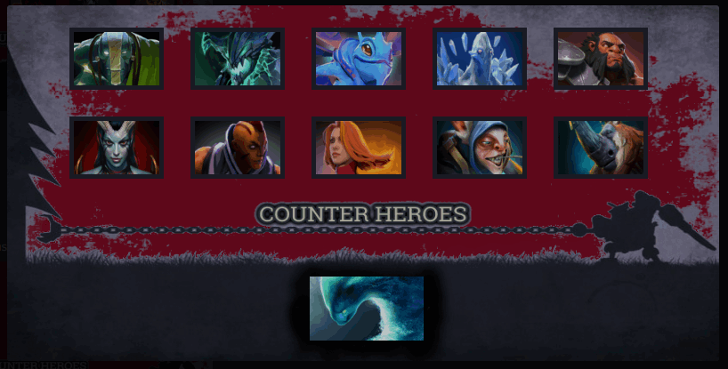
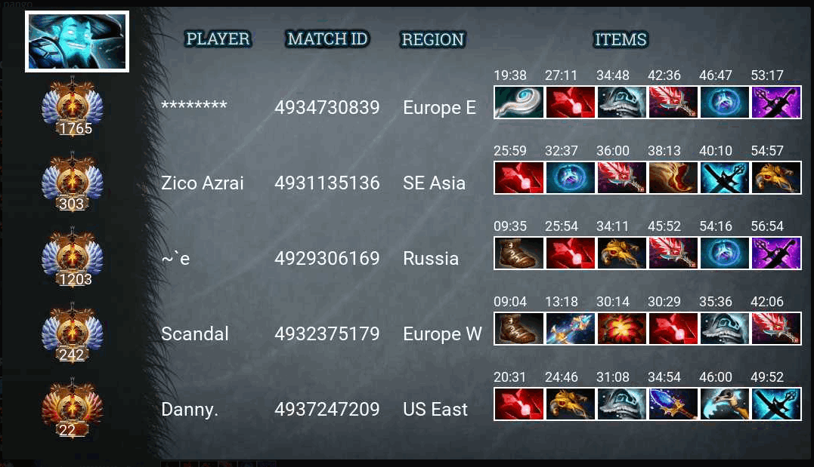
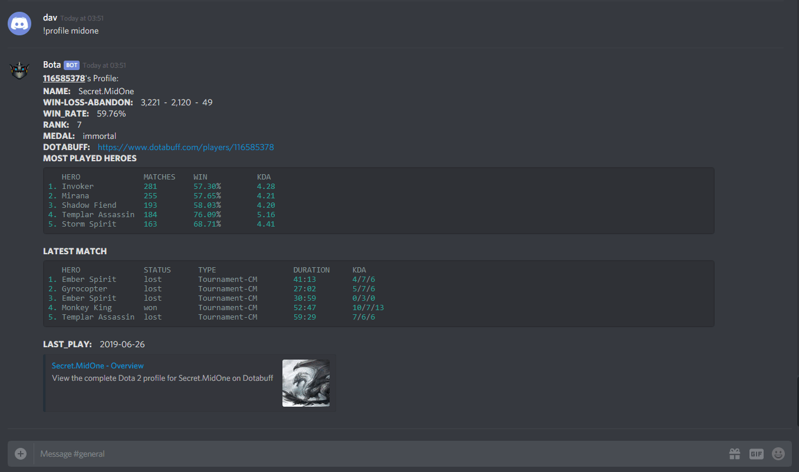

# BOTA
BOT-A is a free Discord Dota 2 bot which provides comprehensive Information of every Dota 2 characters and exciting features for the community. Pull request are welcome and report any issues you find. The Bot is still in beta so I don't expect it to be perfect. <br/>  
**Website:** [https://bota.tech/](https://bota.tech/)<br/>
[](https://discord.gg/a7QYPWd)  [](https://discordapp.com/api/oauth2/authorize?client_id=501100945405378562&permissions=388176&scope=bot)

## Commands & Screenshots
Commands can be found at at [here](https://bota.tech/index.html#table1-7)<br/>
Screenshots:
1. Command:  `!counter  morphling`  
2. Command:  `!item storm` 
3. Command:  `!profile midone` 

## Setup
### Pre-Requirements:
Before setting up the environment we first need to get:
1. Discord Token
2. Discord Client ID
3. Dota2 API key
4. Twitch Client ID
5. Discord User (Optional)

* To get `Discord Token` and `Discord Client ID` you can check [this](http://github.com/reactiflux/discord-irc/wiki/Creating-a-discord-bot-&-getting-a-token)
* You can get your  `Dota2 API key` from [here](https://steamcommunity.com/dev/apikey)
* To get `Twitch Client ID` you need to register an application in Twitch developer. You can follow [this](https://dev.twitch.tv/docs/v5#getting-a-client-id) 
* You can get your `Discord User` by clicking on your profile in discord. It will look like `YourName#1234` eg: `bendang#3278`

Once this is done you can assign all this key values in `bota/private_constant.py`.

### Install Requirements
```bash
sudo sh setup.sh

# Setup Postgres database (New)
sh db_setup.sh
```
### Run
**Run the bot**
```bash
sh run_bota.sh
```
`run_bota.sh` runs two programs parallely on the screen background:
1. `main.py`: Bot application server where all commands are executed
2. `background_scrap.py`: Scans and Updates the data twice a day

**Stop the bot**
```bash
sh stop_bota.sh
```

### Data Collection Source
1. [DotaBuff](https://www.dotabuff.com/)
2. [Reddit](https://www.reddit.com/r/DotA2/)
3. [Twitch](https://www.twitch.tv/)
4. [D2PT](http://www.dota2protracker.com/)
5. [DotaVoyance](http://dotavoyance.com/)
6. Dota2API
